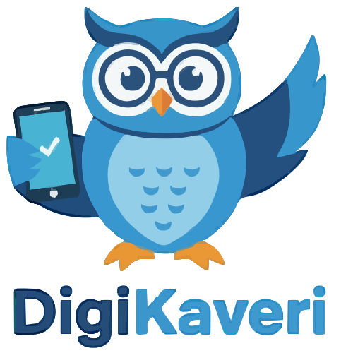
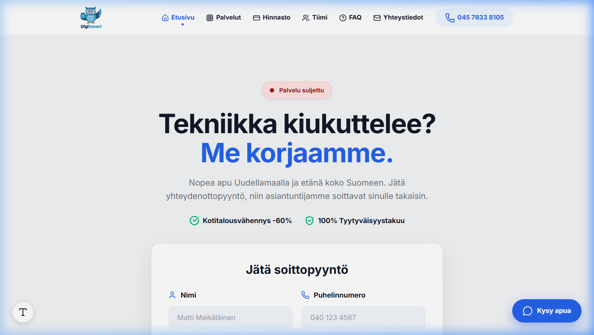

# DigiKaveri — Arjen IT-apu

**Your reliable "Digital Buddy" for everything tech. From buying your first tablet to fixing your old PC.**

---

## 📸 Esikatselu (Preview)

---

### 🤝 The Mission

Technology should be a tool, not a barrier. **DigiKaveri** provides a "human-first" approach to IT. We don't just fix problems; we help you choose the right tools and keep them running smoothly for years.

Based in **Uusimaa**, we offer a hybrid service: **Remote support** for speed and cost-efficiency, and **On-site visits** for hardware, cleaning, and personal consulting.

---

## 🛡️ Luottamus & Takuu (Trust & Guarantee)

- **100% Tyytyväisyystakuu:** Jos emme osaa auttaa, et maksa mitään. Riski on täysin meillä.
- **Kotitalousvähennys -60%:** Työmme oikeuttaa merkittävään verovähennykseen kaikilla kotikäynneillä.

---

## 🛠️ Service Offerings

| Service                   | Remote | On-Site | Description                                           |
| :------------------------ | :----: | :-----: | :---------------------------------------------------- |
| **Purchase Consulting**   |   ✅   |   ✅    | Helping you choose the best laptop, phone, or tablet. |
| **Antivirus & Security**  |   ✅   |   ✅    | Installing protection and cleaning up malware/ads.    |
| **PC Repair & Fixes**     |   ✅   |   ✅    | Troubleshooting Windows/Mac/Android errors.           |
| **Physical Maintenance**  |   ❌   |   ✅    | Dust removal and cleaning for better performance.     |
| **Network & Wi-Fi**       |   ✅   |   ✅    | Setting up routers and fixing "dead zones" at home.   |
| **Printer & Peripherals** |   ✅   |   ✅    | Getting your printer, scanner, or camera working.     |

---

## 🚀 Why DigiKaveri?

1. **Buying Advice:** We help you avoid "overpaying" for tech you don't need.
2. **Security First:** We ensure your antivirus is active and your data is safe.
3. **Longevity:** Physical cleaning and software optimization to make your devices last longer.
4. **Local Trust:** We are Uusimaa-based and prefer building long-term relationships with our clients.

---

## 💻 Tech Stack & Features

- **Senior-Friendly UI:** Large typography, high contrast, and accessible layout flows.
- **Multilingual Support:** Fully translated FI/EN versions with automatic detection.
- **Automated Status Beacon:** Live "Open/Closed" logic calculated in Helsinki time.
- **Privacy First:** GDPR-compliant cookie consent and anonymized analytics.
- **PWA Ready:** Installable on Android, iOS, and Desktop.
- **Modern Glassmorphism:** Premium UI design with frosted glass effects.
- **No Framework Clean Code:** Pure HTML5 / CSS3 for 100/100 performance.

### 🏃‍♂️ Running Locally

1.  Clone this repository.
2.  Simply open **`index.html`** in any modern browser.

---

### Built by [FIMARx](https://github.com/FIMARx)

_"Making technology accessible, one device at a time."_

