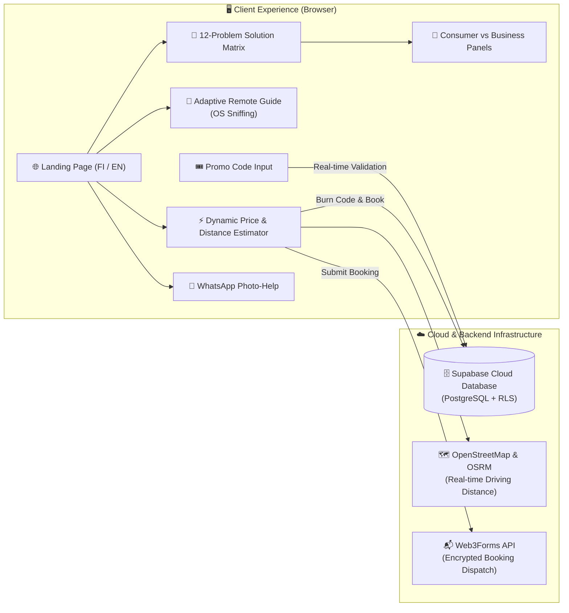

<div align="center">

  

  # DigiKaveri — Digital Buddy for Everyday IT Support
  ### *Inhimillistä, luotettavaa ja selkokielistä IT-tukea koteihin ja pienyrityksille.*

  <p align="center">
    <a href="https://digikaveri.com/"></a>
    <a href="https://supabase.com/"></a>
    <a href="https://vitejs.dev/"></a>
    <a href="#"></a>
    <a href="#"></a>
    <a href="#"></a>
    <a href="LICENSE"></a>
  </p>

</div>

---

## 💡 About DigiKaveri

Technology should empower people, not overwhelm them. **DigiKaveri** (*"Digital Buddy"*) bridges the digital divide with patient, jargon-free technical assistance in **Uusimaa, Finland** 🇫🇮 and remote support across the entire country.

- 🚗 **On-site Home Visits**: Friendly in-person computer repair, Wi-Fi optimization, printer setup, smart TV tuning, and digital guidance across Espoo, Helsinki, Vantaa, and Kauniainen.
- ⚡ **Instant Remote Help**: Secure 1-click screen-sharing remote support nationwide.
- 📸 **WhatsApp Photo-to-Help**: Snap a photo of an error screen and receive instant, free diagnosis on WhatsApp.
- 👵 **Senior & Family Support**: Specialized patient assistance for elderly relatives (banking logins, OmaVero, TV setup) with direct billing options for adult children.
- 💼 **Business & Remote Work**: Reliable workstation setup, secure VPNs, Microsoft 365, and on-demand maintenance without lock-in contracts.
- 🏛️ **2026 Tax Savings**: 100% eligible for Finland's official **-35% Kotitalousvähennys** (household tax deduction) on labor (max €1,600/person).
- 🛡️ **"Ei ratkaisua, ei laskua"**: 100% satisfaction guarantee — if an issue cannot be resolved, the client is charged 0 €.

---

## 🏗️ System Architecture


```mermaid
flowchart LR
    subgraph Client["🖥️ Client Experience (Browser)"]
        Landing["🌐 Landing Page (FI / EN)"]
        Solutions["🧩 12-Problem Solution Matrix"]
        Tabs["🔀 Consumer vs Business Panels"]
        Guide["🧠 Adaptive Remote Guide\n(OS Sniffing)"]
        Estimator["⚡ Dynamic Price & Distance Estimator"]
        PromoInput["🎟️ Promo Code Input"]
        WhatsApp["📸 WhatsApp Photo-Help"]
    end

    subgraph CloudServices["☁️ Cloud & Backend Infrastructure"]
        Supabase[("🗄️ Supabase Cloud Database\n(PostgreSQL + RLS)")]
        Nominatim["🗺️ OpenStreetMap & OSRM\n(Real-time Driving Distance)"]
        Web3Forms["📬 Web3Forms API\n(Encrypted Booking Dispatch)"]
    end

    Landing --> Solutions
    Solutions --> Tabs
    Landing --> Estimator
    Landing --> WhatsApp
    Estimator --> Nominatim
    PromoInput -->|"Real-time Validation"| Supabase
    Estimator -->|"Burn Code & Book"| Supabase
    Estimator -->|"Submit Booking"| Web3Forms
    Landing --> Guide
```

---

## ✨ Key Features

### 1. 🎟️ Pure Cloud Single-Use Promo Code System (Supabase)
- **Zero Client-Side Secrets**: No exposed algorithms, seeds, or generation formulas in frontend code or GitHub.
- **Instant Global Validation**: Validates unique codes (e.g. `ESPOO15-A1`, `DK15-VIP1`) against Supabase in real time.
- **Submit-Time Burn Protection**: Codes are redeemed globally (`is_redeemed: true`) only upon successful form submission, preventing premature burning.
- **Local CLI Generator**: Run `npm run generate-codes` locally to batch-generate clean flyer codes with ready-to-paste SQL insert queries.

### 2. ⚡ Dynamic Price & Distance Estimator
- **Real-Time Driving Cost Routing**: Uses OpenStreetMap Nominatim and OSRM (Open Source Routing Machine) with in-memory caching to calculate exact driving distance and travel fees from Espoo.
- **2026 Tax Deduction Calculator**: Accurately computes customer net cost with the official 2026 Finnish **-35% Kotitalousvähennys** on labor.
- **Interactive Multi-Service Configurator**: Dynamic quantity selectors for Remote Support, Home Visits, and Annual PC Maintenance.

### 3. 📸 WhatsApp "Photo-to-Help" Fast Diagnostic Pipeline
- **Zero-Friction Help**: Floating quick-action banner allowing customers to snap a phone photo of an error dialog and launch a prefilled WhatsApp chat with a single tap.

### 4. 👵 Senior & Family Support Offering
- **Dedicated In-Home Assistance**: Tailored for seniors needing help with banking credentials, OmaVero, Digi-TV, and smartphones.
- **Third-Party Family Invoicing**: Clean toggle in booking forms for adult children ordering support for aging parents.

### 5. 🔀 Segmented Consumer vs. Business Service Tables
- **Segmented Tab Switcher**: Seamless toggle between consumer and business offerings with full coverage of all 12 common technical problem categories.
- **Smart Deep-Linking**: Solution grid cards automatically flip and focus the relevant service panel upon interaction.

### 6. 🧠 Adaptive OS Auto-Detecting Remote Guide
- **Platform Sniffing**: Inspects the visitor's operating system (Windows, macOS, Android, iOS) on page load and customizes setup instructions and software download links.
- **Segmented Mobile Controls**: Smooth native touch switcher for quick platform switching.
- **Interactive Lightbox**: Full-screen zoomable step-by-step screenshots with keyboard trap accessibility.

### 7. 📢 Real-Time Campaign Engine (`campaign.json`)
- **Dynamic Themes**: Preset gradients (`sunset`, `aurora`, `emerald`, `royal`) with tailored Dark Mode variants.
- **Live Countdown Timer**: Real-time ticker synchronizing offer expiration with memory-safe interval cleanup.
- **Smart Dismiss**: Persistent *"Älä näytä enää"* preference saved to `localStorage`.

### 8. 🌗 Silky Smooth Dark Mode & Native View Transitions
- **View Transitions API**: 350ms cross-fade animation when toggling themes.
- **Dynamic Mobile Status Bar Sync**: Dynamically updates `<meta name="theme-color">` to match Dark/Light mode in mobile browsers.

### 9. 🔍 Real-Time Live FAQ Search
- **Instant Client Filter**: Zero-delay search across all questions and answers.
- **Dynamic Search Highlighting**: Marks search keywords with `<mark class="faq-highlight">` badges in real time.

---

## 🛠️ Tech Stack

| Layer | Technology | Details |
| :--- | :--- | :--- |
| **Bundler & Dev Server** | [Vite 6](https://vitejs.dev/) | Lightning-fast HMR and optimized ES module bundling |
| **Database** | [Supabase](https://supabase.com/) | PostgreSQL cloud database with strict Row Level Security (RLS) |
| **Templating** | [Handlebars](https://handlebarsjs.com/) | Component-driven architecture via `vite-plugin-handlebars` |
| **Styling** | Vanilla CSS3 | Modular design system with CSS custom properties & WCAG AA contrast |
| **Typography** | Inter & Outfit | 100% self-hosted typography via `@fontsource` (GDPR-compliant) |
| **Icons** | [Lucide Icons](https://lucide.dev/) | Lightweight, modern vector SVG icons |
| **Privacy & GDPR** | Vanilla CookieConsent v3 | Google Consent Mode v2 & GDPR compliance manager |
| **PWA & Offline** | Service Worker (`sw.js`) | Offline cache strategy for zero-latency asset loading |

---

## 🛡️ Security, Privacy & Compliance

- 🔒 **Row Level Security (RLS)**: Public client access is strictly limited to `SELECT` and `UPDATE` on specific promo codes. Direct schema modification and deletion are impossible.
- 🛡️ **Edge Security Headers**: Strict HTTP headers (`X-Content-Type-Options`, `X-Frame-Options: SAMEORIGIN`, `Referrer-Policy`, and `Permissions-Policy`) deployed via `public/_headers`.
- 🇪🇺 **GDPR & Privacy First**: Zero third-party font tracking. Cookie preferences managed locally with granular consent controls.
- ♿ **Accessibility (WCAG 2.1 AA)**: Skip links, high-contrast `:focus-visible` outlines, ARIA attributes, and automatic `prefers-reduced-motion` resets.

---

## 📂 Project Structure

```text
DigiKaveri/
├── 📄 index.html               # Finnish Homepage
├── 📄 etayhteys.html           # Finnish Remote Support Hub
├── 📄 tietosuoja.html          # Finnish Privacy Policy
├── 📄 kayttoehdot.html         # Finnish Terms of Service
├── 📄 404.html                 # Finnish 404 Error Page
├── 📁 en/                      # English Pages (index, remote-support, privacy, terms, 404)
├── 📁 src/
│   ├── 📁 data/                # Dynamic Campaign Config (campaign.json)
│   ├── 📁 locales/             # i18n Translation Dictionaries (fi.json, en.json)
│   ├── 📁 partials/            # Handlebars Partials (nav, mobile-nav, header, footer, scripts)
│   └── 📁 js/                  # Modular Logic (main, promo-validator, estimator, contact, quiz, guide)
├── 📁 css/                     # Tokenized Design System (variables, global, home, guide, legal, fonts)
├── 📁 scripts/                 # Private CLI Utilities (generate-codes.js)
├── 📁 public/                  # Static Assets, Favicons, Manifest, Service Worker (sw.js), Security Headers (_headers)
├── 📄 vite.config.js           # Multi-Page Build Pipeline & Handlebars SSG Configuration
└── 📄 package.json             # NPM Dependencies & Scripts
```

---

## 🚀 Getting Started

### Prerequisites
- **Node.js 20+**
- **npm 10+**

### 1. Installation
```bash
git clone https://github.com/FIMARx/DigiKaveri.git
cd DigiKaveri
npm install
```

### 2. Local Development
```bash
npm run dev
```
Starts the local development server at `http://localhost:3000/` (or specified port).

### 3. Production Build & Preview
```bash
# Build optimized static production bundle to dist/
npm run build

# Preview production build locally
npm run preview
```

### 4. Generating Promo Codes for Flyers
```bash
# Generate 5 default codes (-15%) with ready-to-paste Supabase SQL
npm run generate-codes

# Generate custom batches (e.g. 10 codes with 20% discount for Espoo)
node scripts/generate-codes.js ESPOO 20 10
```

---

## ⚖️ License & Copyright

Copyright © 2026 **[FIMARx](https://github.com/FIMARx) / [DigiKaveri](https://digikaveri.com)**. All Rights Reserved.

This project and all related source code, assets, branding, and written content are proprietary. Unauthorized copying, distribution, modification, or commercial re-use without explicit written consent is strictly prohibited. See [`LICENSE`](LICENSE) for complete details.

---

<div align="center">

  Crafted with ❤️ by **[FIMARx](https://github.com/FIMARx)**  
  *“Making everyday technology effortless, reliable, and accessible for everyone.”*

</div>
